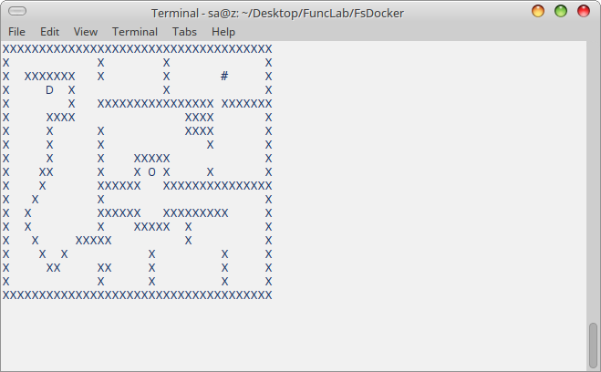
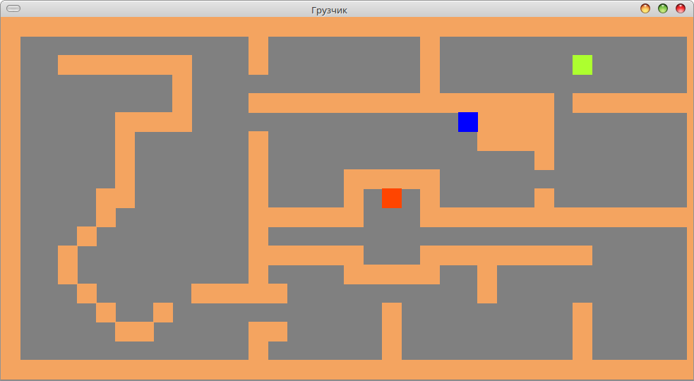

# FuncLab
Functional way of programming with F#

2. actor - пример клиент-серверного приложения с использованием 
модели акторов стандартная реализация MailboxProccesor 

1. FsDocker is a project for learning me F# and Avalonia.UI

- dotnet run

- dotnet run -ui

